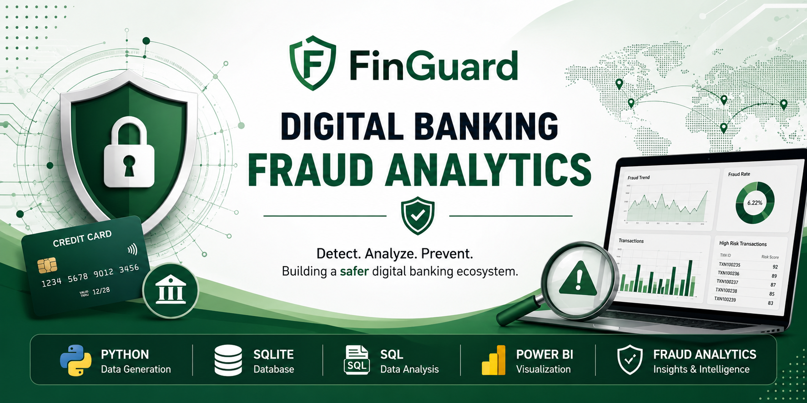
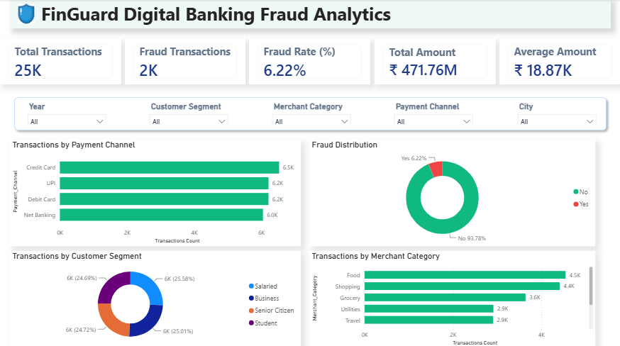
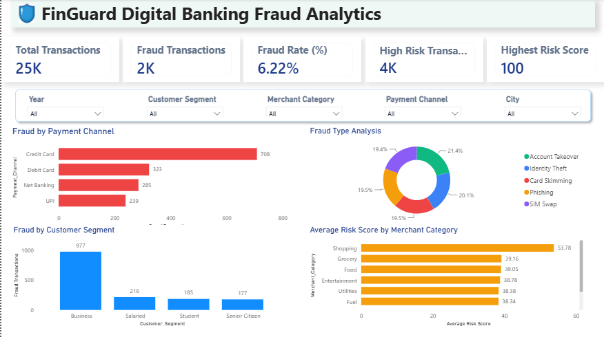

<p align="center">
  
</p>

# 🛡️ FinGuard – Digital Banking Fraud Analytics


> **An end-to-end Banking Fraud Analytics project featuring realistic synthetic data generation, SQL-based analysis, and interactive Power BI dashboards for fraud detection and business intelligence.**
---

## 📌 Project Overview

FinGuard is an end-to-end Banking Fraud Analytics project that simulates realistic banking transactions, stores them in a relational database, and analyzes fraud patterns through interactive Power BI dashboards.

Unlike traditional academic datasets, this project uses rule-based synthetic data generation to create realistic fraud behaviour. Risk scores and fraud labels are influenced by multiple business rules such as transaction amount, payment mode, merchant category, customer profile, transaction timing, device type, and geographic mismatch.

The project demonstrates the complete analytics pipeline—from data generation to visualization—and showcases how Python, SQL, SQLite, and Power BI can be integrated to solve a real-world fraud analytics problem.

---

## 🎯 Objectives

- Generate realistic banking transaction data using Python.
- Simulate fraud using business-driven risk rules.
- Store transactional data in SQLite.
- Perform SQL-based analysis.
- Build interactive Power BI dashboards.
- Identify fraud trends and high-risk behaviour.
- Demonstrate an end-to-end data analytics workflow.

---

## 🏗️ Project Architecture

```

Python Scripts
        │
        ▼
Synthetic Banking Dataset
        │
        ▼
SQLite Database
        │
        ▼
SQL Queries
        │
        ▼
Power BI Dashboards
        │
        ▼
Business Insights

```
---

# 🛠️ Tech Stack

| Category | Technologies |
|----------|--------------|
| Programming Language | Python 3 |
| Data Processing | Pandas |
| Database | SQLite |
| Query Language | SQL |
| Data Visualization | Power BI |
| Version Control | Git & GitHub |

---

# 📂 Project Structure

```text
FinGuard-Digital-Banking-Fraud-Analytics/
│
├── data/
│   ├── customers.csv
│   ├── merchants.csv
│   └── transactions.csv
│
├── database/
│   └── banking.db
│
├── docs/
│   └── project_plan.md
│
├── images/
│   ├── executive_dashboard.png
│   └── fraud_dashboard.png
│
├── output/
│
├── PowerBi/
│   └── FinGuard_Dashboard.pbix
│
├── scripts/
│   ├── config.py
│   ├── generate_customers.py
│   ├── generate_merchants.py
│   ├── generate_transactions.py
│   └── database_loader.py
│
├── sql/
│   ├── create_tables.sql
│   └── queries.sql
│
├── .gitignore
├── LICENSE
├── README.md
└── requirements.txt
```

---

# 📊 Dataset

The project consists of three synthetic datasets generated using Python.

### 👤 Customers

Contains customer demographic and banking information.

**Important fields**

- Customer ID
- Name
- Age
- Gender
- City
- State
- Customer Segment
- Occupation
- Monthly Income
- Account Opening Year
- Preferred Payment Mode
- Preferred Device

---

### 🏪 Merchants

Contains merchant information used during transactions.

**Important fields**

- Merchant ID
- Merchant Name
- Merchant Category
- City
- State

---

### 💳 Transactions

Stores banking transactions generated using business rules.

**Important fields**

- Transaction ID
- Customer ID
- Merchant ID
- Transaction Date
- Transaction Time
- Transaction Type
- Amount
- Payment Channel
- Device Type
- Risk Score
- Fraud Type
- Is Fraud

---

# 🧠 Rule-Based Fraud Simulation

Unlike randomly generated datasets, FinGuard uses a rule-based fraud simulation model to create realistic banking transactions.

The fraud probability is influenced by multiple business conditions commonly observed in banking fraud detection systems.

### Business Rules

- 💳 Credit Card transactions carry higher fraud risk.
- 📱 Mobile devices slightly increase transaction risk.
- 🛒 Shopping and Electronics merchants are considered higher-risk categories.
- 💰 High-value transactions increase the overall risk score.
- 🌙 Late-night transactions (10 PM – 4 AM) are considered more suspicious.
- 👴 Senior Citizens making unusually large transactions receive additional risk.
- 🏢 Large Business transactions contribute to higher fraud probability.
- 🌍 Transactions occurring in a different city from the customer increase the risk score.

Instead of marking every high-risk transaction as fraud, FinGuard assigns fraud probabilistically based on the calculated risk score, producing more realistic fraud patterns.

---

# 📊 Dashboards

## Executive Dashboard



### Highlights

- Overall transaction overview
- Fraud rate monitoring
- Customer segmentation
- Merchant category analysis
- Payment channel distribution

---

## Fraud Investigation Dashboard



### Highlights

- Fraud by Payment Channel
- Fraud Type Analysis
- Fraud by Customer Segment
- Average Risk Score by Merchant Category

---

# 📈 Key Insights

- Credit Card transactions recorded the highest number of fraudulent activities.
- Shopping merchants showed the highest average fraud risk.
- Business customers generated the largest share of fraud transactions.
- Fraud simulation achieved an overall fraud rate of approximately **6%**, closely resembling realistic banking environments.
- Risk scoring combines transaction value, device type, merchant category, customer profile, transaction timing, and geographic mismatch.

---

# ⚙️ Installation

Clone the repository:

```bash
git clone https://github.com/aashna1/FinGuard-Digital-Banking-Fraud-Analytics.git
```

Navigate to the project folder:

```bash
cd FinGuard-Digital-Banking-Fraud-Analytics
```

Install dependencies:

```bash
pip install -r requirements.txt
```

---

# ▶️ How to Run

Generate the synthetic datasets:

```bash
python scripts/generate_customers.py
python scripts/generate_merchants.py
python scripts/generate_transactions.py
```

Load the generated data into SQLite:

```bash
python scripts/database_loader.py
```

Open the Power BI dashboard:

```text
PowerBI/FinGuard_Dashboard.pbix
```

Refresh the data to explore the latest analytics dashboards.

---

# 🚀 Future Enhancements

- Add machine learning models for fraud prediction.
- Implement anomaly detection using Isolation Forest.
- Integrate real-time transaction streaming.
- Build interactive web dashboards using Streamlit.
- Connect to cloud databases for large-scale analytics.
- Add advanced fraud investigation reports.

---

# 📚 Skills Demonstrated

- Python Programming
- Data Generation & Simulation
- Data Cleaning
- SQL & SQLite
- Data Modeling
- Power BI Dashboard Development
- Business Intelligence
- Data Visualization
- Fraud Analytics
- Git & GitHub

---

# 👩‍💻 Author

**Aashna Kashyap**

B.Tech Computer Science Engineering  
Netaji Subhas University of Technology (NSUT)

GitHub: https://github.com/aashna1

---

<p align="center">
⭐ Thank you for visiting this repository!
</p>